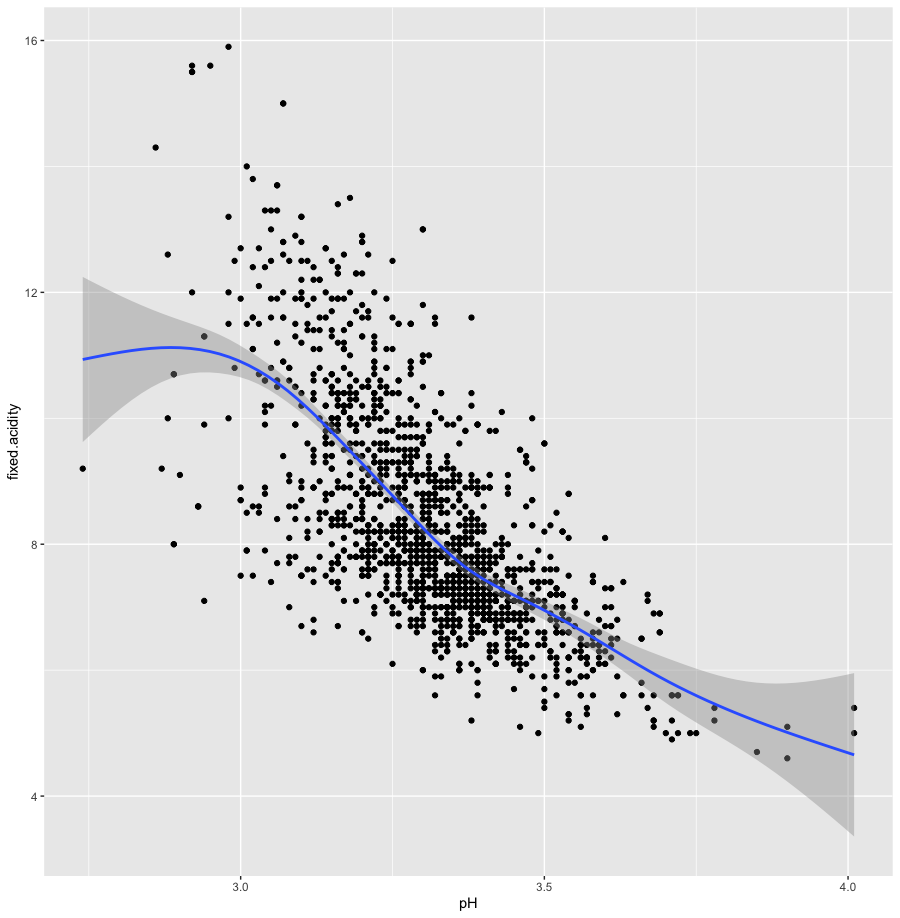
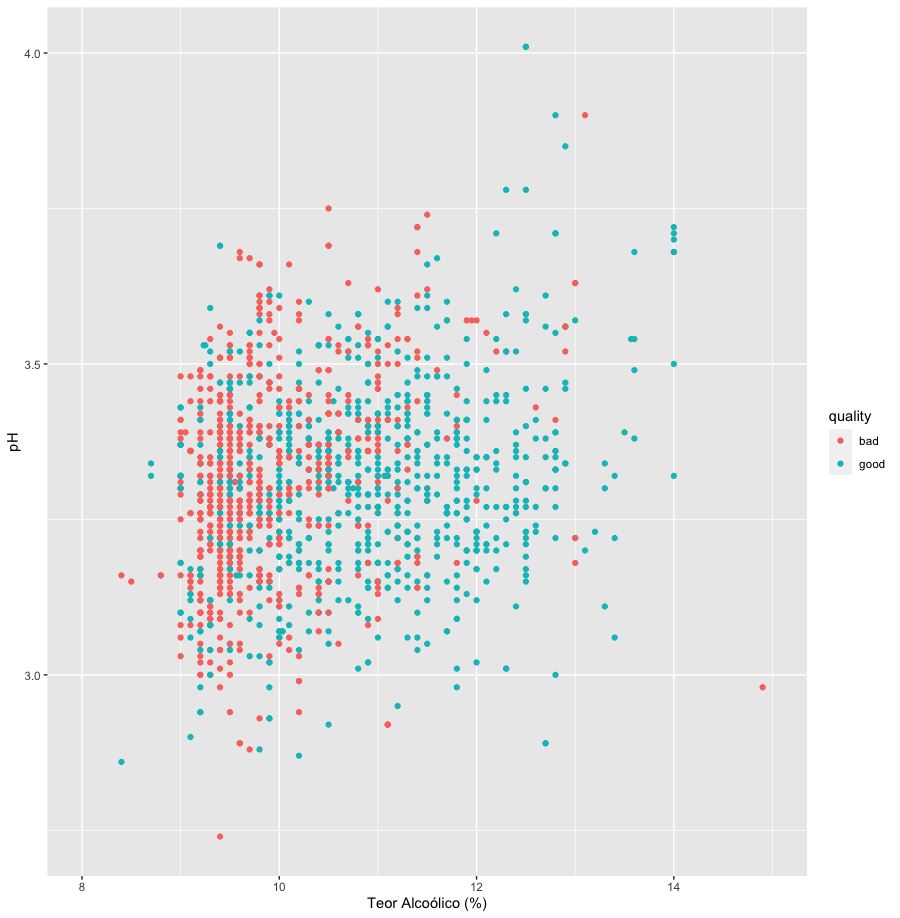
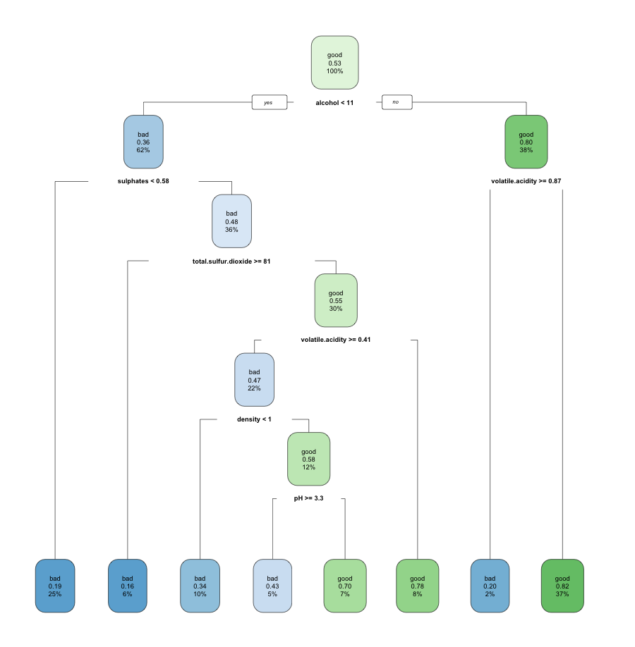

# Introdução à Ciência de Dados com R - Prova 2
Aluno: João Victor Mendes Freire

RA: 758943

## Exercício 1
Utilizando uma suavização sobre o gráfico de acidez fixa x pH, é possível notar uma relação de linearidade entre o pH e a acidez do vinho.

Ao utilizar o coeficiente de correlação, obtemos um valor r = -0.6829. Como |r| > 0.2, é possível considerar que existe uma alta correlação entre os atributos.
```R
library(tidyverse)

wine <- read.csv("/Users/joaovicmendes/Desktop/wine.csv")

# Exercício 1
# Utilizando uma suavização sobre o gráfico de acidez fixa x pH
ggplot(data = wine, aes(x = pH, y = fixed.acidity)) + geom_point() + geom_smooth()

# Coeficiente de correlação
cor(wine$fixed.acidity, wine$pH)
```


## Exercício 2

a) O objetivo é visualizar como o pH e o teor alcoólico de um vinho se distribuem em relação à sua categoria.

b) Os atributos escolhidos foram: pH, qualidade do vinho e teor alcoólico.

c)
```R
wine_filtered <- arrange(wine, desc(alcohol), desc(pH)) %>%
  select(quality, alcohol, pH)

ggplot(data = wine_filtered, aes(x = alcohol, y = pH, colour = quality)) + 
  geom_point() + xlim(8, 15) +
  labs(x = "Teor Alcoólico (%)", y = "pH")
```

d) Observando a visualização, percebemos que, em geral, tanto vinhos bons quanto vinhos ruins se encontram na mesma faixa de pH (entre 3 e 3,5). No entanto, fica claro que vinhos melhores mais frequentemente tem teores alcoólicos mais elevados em relação aos vinhos ruins.



## Exercício 3
```R
# Exercício 3
library(rpart) # para a construção da árvore de decisão
library(rpart.plot) # para a visualização gráfico da árvore

# Modelo
prepare_hold_out <- function(tbl, training_perc) {
  tbl_mixed <- tbl[sample(1:nrow(tbl)), ]
  nrow <- nrow(tbl_mixed)
  
  nrow_train <- ceiling(training_perc * nrow)
  data_trn <- tbl_mixed[1:nrow_train, ]
  data_tst <- tbl_mixed[(1+nrow_train):(nrow), ]
  
  list(training = data_trn, test = data_tst)
}

wine_split <- prepare_hold_out(wine, 0.8)
tree <- rpart(quality ~ fixed.acidity + volatile.acidity +
                        citric.acid + residual.sugar +
                        chlorides + free.sulfur.dioxide +
                        total.sulfur.dioxide + density + pH +
                        sulphates + alcohol,
              data = wine_split$training)
rpart.plot(tree)

# Predição
qualidade_predita <- predict(tree, wine_split$test, type = "class")

table(wine_split$test$quality)
table(qualidade_predita)

# Avaliação
confusion_matrix <- table(wine_split$test$quality, qualidade_predita)
confusion_matrix

TP <- confusion_matrix[2, 2]
TN <- confusion_matrix[1:1]
FP <- confusion_matrix[1, 2]
FN <- confusion_matrix[2]

miss_rate <- FN / (FN+TP)
```

a) Para avaliarmos a árvore produzida, criamos uma matriz de confusão para comparar os resultados preditos e as respostas corretas de um determinado subconjunto dos dados. A partir dos dados nela contidos, podemos estabelecer métricas como *miss rate* (taxa de falsos negativos). O código da matriz esta na seção "Avaliação" do trecho de código acima. A taxa encontrada foi de aproximadamente 30%.

b)



c) O nó raíz é o atributo teor alcoólico (*alcohol*).

d) A matriz de confusão gerada foi
```
> confusion_matrix[1:2, 1:2]
      qualidade_predita
       bad good
  bad   91   49
  good  55  124
```
i. TP (True Positive) = 124

ii. TN (True Negative) = 91

iii. FP (False Positive) = 49

iv. FN (False Negative) = 55

